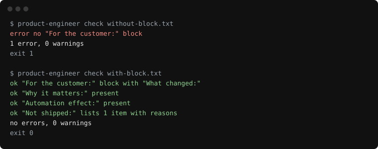

<p align="center"></p>

<p align="center"><a href="https://bubblegunn.github.io/product-engineer/">bubblegunn.github.io/product-engineer</a></p>
<p align="center">English | <a href="README.tr.md">Türkçe</a> | <a href="README.zh-CN.md">简体中文</a></p>

<p align="center"><em>Your agent ships code. product-engineer makes it ship outcomes.</em></p>

<p align="center">
  
  
  
  
  
</p>

An agent skill that makes an AI coding agent think like a product engineer instead of a
code printer. Before building, it restates the work as a customer outcome. In every commit
and pull request, it writes a plain-language "For the customer" block. It refuses to call
unobserved work done, names what it deliberately did not build, and never prints a number
it did not count.

## See it

The same commit, before:

```
fix(notifications): classify IsSystem events as idempotent and skip the badge increment
```

After:

```
fix(notifications): classify IsSystem events as idempotent and skip the badge increment

For the customer:
What changed: Things the system handles on its own no longer light up the phone or the menu badge; only items that need a person do.
Why it matters: The badge count means "something needs you" again, so people stop ignoring it.
Automation effect: Automatic housekeeping events are now fully handled without anyone looking at them.
```

The agent's report, before:

```
Done. All 42 tests pass.
```

After:

```
Watched it in staging logs: 3 of 3 webhook retries logged, final failure recorded with the booking id.
Could not check: production, no deploy yet.
Not shipped:
- Dead-letter queue: three retries cover every failure in 90 days of logs.
```

The check, on a message without the block and then with it (the two fixtures are in
[`test/fixtures/`](test/fixtures/), so the picture can be reproduced from the command):



A longer pair, unedited, from the evaluation: [`docs/examples.md`](docs/examples.md).

## Install

```
npx skills add Bubblegunn/product-engineer
```

That places the skills for the agents in your project (Claude Code, Codex, Cursor, Copilot,
Gemini CLI and the rest). Where each file lands, the Claude Code plugin commands, the git
hook and the CI action are in [`docs/install.md`](docs/install.md); Cursor as a rule file
rather than a skill is in [`docs/cursor.md`](docs/cursor.md).

## Measured

Eight small tasks, each run twice with Claude Code in headless mode: once bare, once with
this skill installed in the repository. One run each, so a smoke test, not a study. The
harness, the fixtures and every transcript are in [`evals/`](evals/), and
[`evals/RESULTS.md`](evals/RESULTS.md) explains the heuristics and what they miss.

| metric | bare | skill | delta |
|---|---|---|---|
| Commit carries the For-the-customer block | 0 / 8 | 8 / 8 | +8 |
| Final message reports an observation or says what it could not check | 1 / 8 | 7 / 8 | +6 |
| Final message names something deliberately not done | 2 / 8 | 7 / 8 | +5 |
| Every number in the final message has a method or scope next to it | 1 / 8 | 1 / 8 | +0 |
| Only the requested files changed (tests and documentation allowed) | 8 / 8 | 8 / 8 | +0 |

Two rows did not move and are printed anyway: the number heuristic scores 1 of 8 in both
conditions, and every file change in both conditions stayed within the task once
documentation edits were allowed for. The heuristics were corrected on 5 September and the
transcripts rescored; [`evals/RESULTS.md`](evals/RESULTS.md) says what changed. The skill
runs took about 60% more turns and cost about 45% more, because they verified more and
wrote more.

## The pack

| skill | what it is | install it when |
|---|---|---|
| [`product-engineer`](skills/product-engineer/SKILL.md) | the seven rules and the reference files | your agent writes code |
| [`customer-block`](skills/customer-block/SKILL.md) | rule 2 alone: the block, with two pairs | you only want the block in commits and pull requests |
| [`done-means-observed`](skills/done-means-observed/SKILL.md) | rule 3 alone: what was watched, what could not be checked | you only want honest completion reports |
| [`release-notes`](skills/release-notes/SKILL.md) | the rules for an agent that writes about software instead of writing it | release notes, changelogs, status updates |

The installer offers all four; pick what you need. Agents that read instruction files
rather than skills (Cursor rules, Copilot instructions, Gemini, Cline, Kiro, Windsurf) get
the same seven rules from files generated out of `SKILL.md`; see
[`docs/install.md`](docs/install.md).

## The seven rules

1. Restate before building. One sentence of customer outcome, or one question.
2. For the customer, every time. What changed, why it matters, automation effect only if real.
3. Done means observed. Logs, data or a real device, or say what you could not check.
4. Build what was asked; name what you did not. A `Not shipped:` list with reasons.
5. No number without a count. Every figure has a command behind it and a scope.
6. Speak the stakeholder's language. A jargon-to-plain table ships with the skill.
7. Smallest change that moves the metric. One ledger line before any design.

Full text: [`skills/product-engineer/SKILL.md`](skills/product-engineer/SKILL.md). The
template, the five questions, the done checklist, the plain-language table and the
not-shipped format are in [`references/`](skills/product-engineer/references/).

## Check a message or a pull request

`product-engineer check` reads a commit message or PR description and reports whether it
carries the block and whether the block reads the way the skill asks: `What changed`, `Why it
matters`, an `Automation effect` line that is either meaningful or absent, a well-formed
`Not shipped:` list, numbers without a method next to them, and jargon from the plain-language
table used without an explanation.

```
node bin/check.mjs check .git/COMMIT_EDITMSG     # or: product-engineer check <file|->
node bin/check.mjs check --pr 12                 # the body through the GitHub API, or gh outside Actions
node bin/check.mjs check --pr 12 --comment       # and one comment on the pull request, updated in place
```

The block also gets a readability line, Flesch for English or Ateşman with `--lang tr`, plus
LIX, as information only. Exit 1 on a missing block, 0 with `--warn`. Run on this repository's own last five commits
it reports no errors and one warning (a sentence quoting the eval counts without a method
word next to it). `--format github` turns the findings into run annotations. As a CI step
(needs `pull-requests: write` for the comment, see [`docs/install.md`](docs/install.md)):

```yaml
      - uses: Bubblegunn/product-engineer@v0
        # with: { warn: "true" }   # report instead of failing
```

## What it does not do

It runs no process and owns no workflow; it composes with spec, TDD and review skills. It
does not write product strategy. It enforces nothing unless you install the hook.

## Where it comes from

These are the rules Efe Genc worked by for four years as a founding engineer on a
hospitality platform and as the sole author of a proactive assistant: a commit convention
that explains every change to a non-technical reader, a definition of done that means
watching the thing behave, and the habit of writing down what was deliberately not built
([The feature I chose not to ship](https://efe-genc-portfolio.vercel.app/writing/the-feature-i-chose-not-to-ship/)).

## Contributing

Rule changes need one before/after pair and one eval task; see
[CONTRIBUTING.md](CONTRIBUTING.md), which also describes the one-command release. The [roadmap](ROADMAP.md) is short on purpose.
Translations and per-stack jargon tables are labelled `good first issue`.

## Stars

<a href="https://star-history.com/#Bubblegunn/product-engineer&Date"></a>

MIT.
